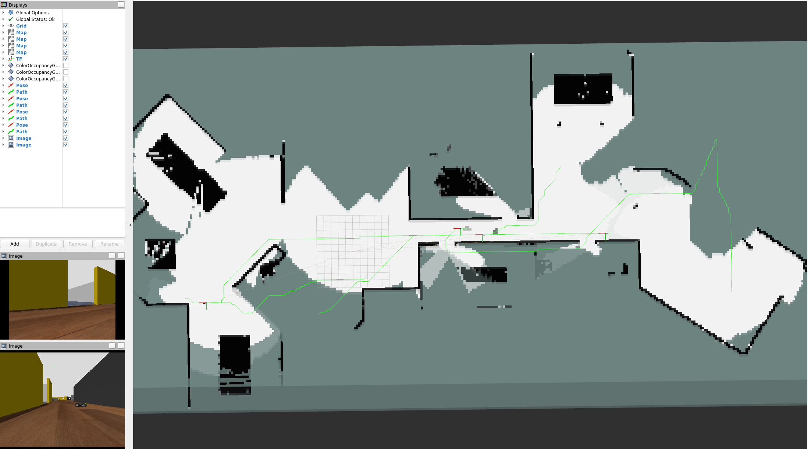
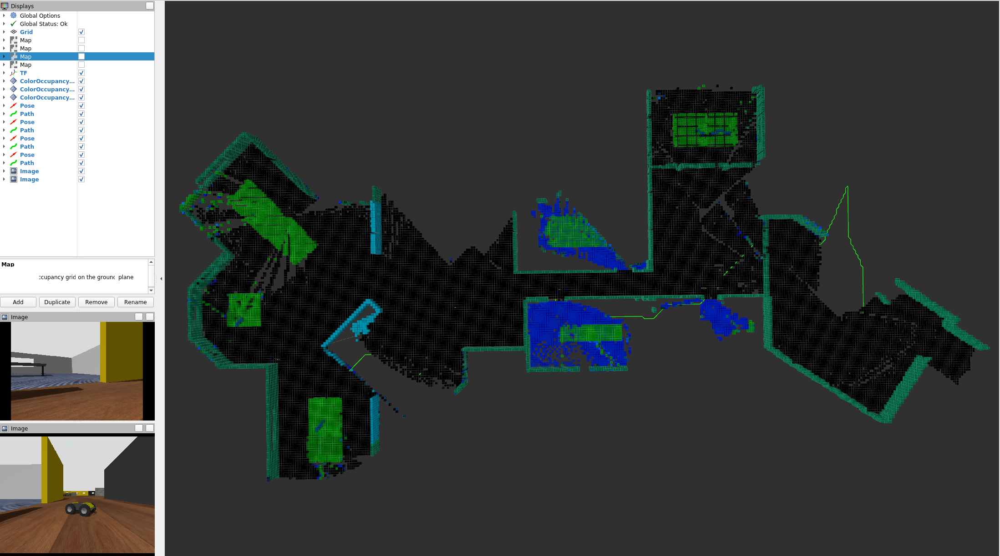

### Introduction
This is the demo repository of [ROAM](https://github.com/ExistentialRobotics/ROAM.git)
### Requirements
1. Ubuntu 20.04 and ROS Noetic
2. Gazebo Fortress [Gazebo Fortress installation](https://gazebosim.org/docs/fortress/install_ubuntu)
3. Othrer dependencies in submodules


### Launch simulation
Please source the workspace before running the nodes
```
roslaunch multi_sim_init semantic_init_multi.launch
```


### Docker 
We also provide docker image for demo, it has been tested on Ubuntu 22.04. [NVIDIA Container Toolkit](https://docs.nvidia.com/datacenter/cloud-native/container-toolkit/latest/install-guide.html) is required to display the simulation. Host with other graphics card may work but not guaranteed.

In dockerfile we install package python-is-python3, which is not suggested to install on your host machine. 

0. Enable GUI in docker container
at your host:
```
xhost +local:docker
```
1. Build the docker image
```
docker compose build
```
2. Start container and run the demo
```
docker compose up
```
3. Open container with bash
```
docker compose run roam_demo bash
```
### Desired result
If everything is set up correctly, you shold see robot exploring around like this:


